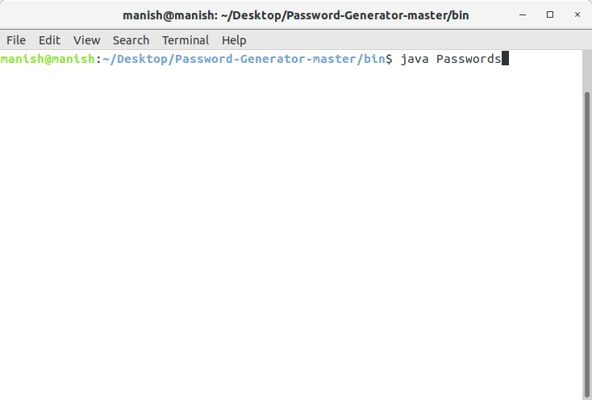
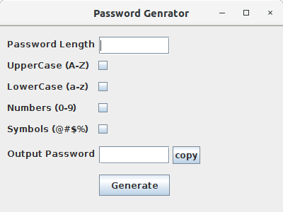
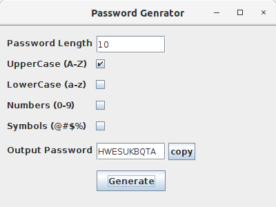

# Project Title

Random Password Generator

## Getting Started

These instructions will get you a copy of the project up and running on your local machine for development and testing purposes. See deployment for notes on how to deploy the project on a live system.

### Prerequisites

What things you need to install the software and how to install them

```
You need the latest java runtime environment or JDK installed on your machine 
```

### Installing

A step by step series of examples that tell you how to get a development env running

```
1.Install the JDK in your machine.
2.Download this project. 
3.In the bin folder of this project open the terminal and type java Password
4.Enter the values in the form to Generator and click on Generate
```
<p align="center">
  
</p>
</br>
</br>


## Built With

* [Java JDk](https://www.oracle.com/technetwork/java/javase/downloads/jdk8-downloads-2133151.html) - The application Gui and Algo

## Authors

* **Manish Sharma** - *Initial work* - [mk8930560](https://github.com/mk8930560)
